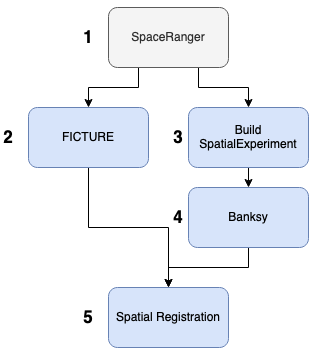

# R Stats Club: nested array jobs and `run_all.sh` scripts (2025-04-04)

In this [R Stats Club](https://research.libd.org/rstatsclub/) session, I'll
cover two general topics:

1. Using **nested array jobs** with SLURM to analyze each element of a dataset
defined by potentially several categorical variables
2. Using **SLURM job dependencies** to organize an analysis workflow into a
`run_all.sh` script, a submittable shell script documenting the order and
structure of many analysis steps

## Set-up

We'll use the [`slurmjobs`](https://github.com/LieberInstitute/slurmjobs) R
package when creating some nested array jobs. It's available from GitHub:

```{r}
#   Install slurmjobs
remotes::install_github("LieberInstitute/slurmjobs")
```

## Nested array jobs

### Basic array jobs

First, we'll introduce the concept of an [array job with the SLURM job scheduler](https://slurm.schedmd.com/job_array.html).
In my opinion, array jobs are one of the most natural ways you can express a
data analysis task when multiple elements of data must undergo the same
processing. In genomics, one example would be finding spatially variable genes
for each tissue sample. With SLURM, a 3-sample dataset would turn into a 3-task
array job, with each sample being processed in parallel. To turn an ordinary
shell script into an array job, just add `#SBATCH --array=1-3%3` like
in [this example](https://github.com/LieberInstitute/visiumStitched_brain/blob/7cef43fe3894c532b39cace2fd2b84011f0c0044/code/03_stitching/03_nnSVG_unstitched.sh#L7).
In this case, the shell script executes 3 tasks in parallel. The only difference
between these tasks is the `SLURM_ARRAY_TASK_ID` environment variable, which
holds a value of either `1`, `2`, or `3`, depending on the task. Continuing this
3-sample example, we can leverage this environment variable to
[subset samples of our dataset](https://github.com/LieberInstitute/visiumStitched_brain/blob/7cef43fe3894c532b39cace2fd2b84011f0c0044/code/03_stitching/03_nnSVG_unstitched.R#L13-L15)
in R so that each sample gets processed through the workflow.

### Nesting

The above example (3-sample dataset with same processing) is the simplest case,
where we're looping over one categorical variable. *Nesting* occurs when we want
to loop over multiple categorical variables. For example, we may have a
workflow where we wish to perform k-means clustering of each tissue sample at
several values of k. I'll introduce two approaches to using array jobs for this
scenario.

#### Nested `sbatch` call

One approach is to use an array job that submits another array job via `sbatch`.
This concept is implemented in the `nested_arrays/01_main*` scripts. In an
[outer loop]([here](https://github.com/Nick-Eagles/LIBD_presentations/blob/main/rstats_nested_arrays/nested_arrays/01_main_wrapper.sh)),
we'll [loop through values of k](https://github.com/Nick-Eagles/LIBD_presentations/blob/63dfd061a633b2155b7e445967717018766127e4/rstats_nested_arrays/nested_arrays/01_main_wrapper.sh#L8)
(2 through 10). The [log path for the inner loop](https://github.com/Nick-Eagles/LIBD_presentations/blob/63dfd061a633b2155b7e445967717018766127e4/rstats_nested_arrays/nested_arrays/01_main_wrapper.sh#L11)
includes both the outer and inner (`%a`) task IDs to make each task have a
unique log. Finally, [we submit the inner loop](https://github.com/Nick-Eagles/LIBD_presentations/blob/63dfd061a633b2155b7e445967717018766127e4/rstats_nested_arrays/nested_arrays/01_main_wrapper.sh#L12-L16).
In the inner loop, we [loop through 4 tasks](https://github.com/Nick-Eagles/LIBD_presentations/blob/63dfd061a633b2155b7e445967717018766127e4/rstats_nested_arrays/nested_arrays/01_main.sh#L6),
representing data samples, with each task [invoking a Python script](https://github.com/Nick-Eagles/LIBD_presentations/blob/63dfd061a633b2155b7e445967717018766127e4/rstats_nested_arrays/nested_arrays/01_main.sh#L20). Inside [the Python script](https://github.com/Nick-Eagles/LIBD_presentations/blob/main/rstats_nested_arrays/nested_arrays/01_main.py),
we access the task IDs for the inner and outer loops to determine the data
sample and k value to use for (a hypothetical) k-means clustering analysis.

#### Single-script loop with `slurmjobs::job_loop()`

A more general approach that works with an arbitrary number of loops (our
example has 2 loops) involves creating a job-submission script with
`slurmjobs::job_loop()` in R. The following lines of code can be used to create
a shell script and R script pair, operating as an array job over both samples
and k values:

```{r}
library(slurmjobs)

job_loop(
    name = '02_job_loop',
    loops = list(
        k = as.character(2:10), sample_id = c('A', 'B', 'C', 'D')
    ),
    memory = '2G',
    create_shell = TRUE,
    create_logdir = FALSE
)
```

The general concept is that [a single array](https://github.com/Nick-Eagles/LIBD_presentations/blob/bb0a8e69c1a272157d1567991e2121228b5181b0/rstats_nested_arrays/nested_arrays/02_job_loop.sh#L10)
loops over both categorical variables, with [modulus division being used to subset each variable](https://github.com/Nick-Eagles/LIBD_presentations/blob/bb0a8e69c1a272157d1567991e2121228b5181b0/rstats_nested_arrays/nested_arrays/02_job_loop.sh#L13-L14)
for the given task ID. The [log path is also unique to the array task](https://github.com/Nick-Eagles/LIBD_presentations/blob/bb0a8e69c1a272157d1567991e2121228b5181b0/rstats_nested_arrays/nested_arrays/02_job_loop.sh#L20), and character variables are [directly passed to R](https://github.com/Nick-Eagles/LIBD_presentations/blob/bb0a8e69c1a272157d1567991e2121228b5181b0/rstats_nested_arrays/nested_arrays/02_job_loop.sh#L42),
where we might perform clustering for each sample and k value.

#### Comparison of options

Each of the above approaches has potential advantages over the other, which I'll
summarize in the below table.

| Topic | Nested `sbatch` | `job_loop()` |
| ---- | ------- | ------- |
| Script readability | More readable when number of tasks is large | Less readable when number of tasks is large |
| Modularity of tasks | Easier to execute a subset of tasks | More complicated to execute a subset of tasks |
| Number of scripts required | 2 | 1 |
| Number of possible loops | Exactly 2 | Any positive integer |

##  `run_all.sh` scripts

In the next topic, we'll cover the concept of a `run_all.sh` script. On the data
science team at LIBD, we contribute to many projects, each associated with a git
repository containing many analysis scripts. A `run_all.sh` script is a shell
script, often associated with an entire project/repository, which sequentially
submits every analysis step as a SLURM job. It has a couple important functions:

- Serves as documentation for how an analysis was done for a project
- Allows automated, hands-off resubmission of a series of analysis steps when data or goals change

LIBD has a template git repository demonstrating an example
[`run_all.sh` script](https://github.com/LieberInstitute/template_project/blob/devel/code/run_all.sh),
which shows can a series of SLURM jobs can be connected via job dependencies. A
job ID associated with one analysis step [can be extracted](https://github.com/LieberInstitute/template_project/blob/44e939c13b1bd49f5ea7daf85ab5d0555f7f0062/code/run_all.sh#L41)
and [used as a condition for a second job starting](https://github.com/LieberInstitute/template_project/blob/44e939c13b1bd49f5ea7daf85ab5d0555f7f0062/code/run_all.sh#L46):
the second job executes as soon as the first succeeds (i.e. returns an exit code
of 0).

### For complex projects

In a project with a complex analysis workflow, organizing a `run_all.sh` script
(which is inherently sequential) can be challenging, but I have some
recommended strategies for making it manageable.

Often, analyses cannot be expressed sequentially or linearly; in general, a
workflow (usually) can be mathematically described as a directed acyclic graph
(DAG), where vertices are analysis steps and edges represent flow of data. I
recommend thinking about your project from a high level, and trying to summarize
the full analysis into major conceptual units. For example, maybe you could
describe your analysis as consisting of data preparation, quality control, and
clustering (even though it consists of far more than just three scripts). Next,
try to draw a diagram of this workflow in terms of the high-level steps,
considering which steps depend on others. In the below graph, I've described my
project in terms of 5 such steps.



If the graph is particularly complicated, it's worth considering a workflow
management tool like [Nextflow](https://www.nextflow.io/) or [Snakemake](https://snakemake.readthedocs.io/en/stable/),
options that are better suited to complex workflows than what's possible with SLURM job
dependencies. Otherwise, the next step is to number each step, more or less
going from left to right and top to bottom (though the exact order is
unimportant). These numbers describe the order to place these steps in your
`run_all.sh` script. Next, flesh out each section with the individual
constituent scripts, using job dependencies to connect the sequence of smaller
steps. I recommend using variables for each job ID that include the number of
the high-level analysis step and the particular script for that step. For
example:

```bash
#   Data preparation
job_id_1_1=$(sbatch --parsable 01_preprocess_data.sh)
job_id_1_2=$(sbatch --parsable --dependency=afterok:${job_id_1_1} 02_clean.sh)

#   Quality control
job_id_2_1=$(sbatch --parsable --dependency=afterok:${job_id_1_2} 01_explore_metrics.sh)
job_id_2_2=$(sbatch --parsable --dependency=afterok:${job_id_2_1} 02_filter.sh)
```